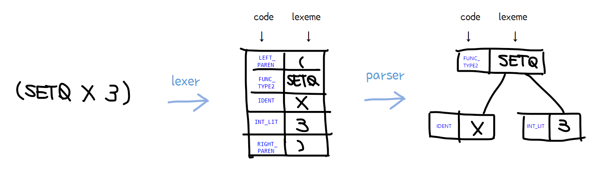
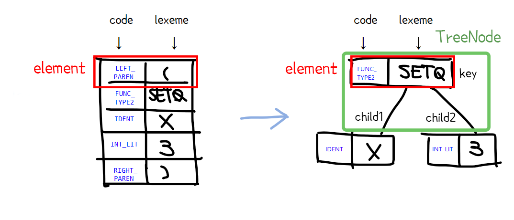
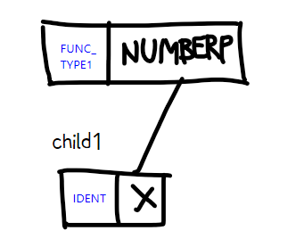
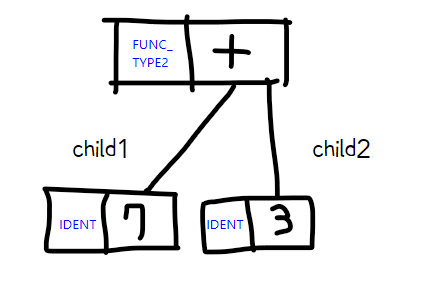
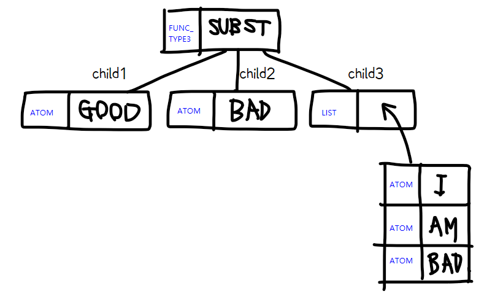
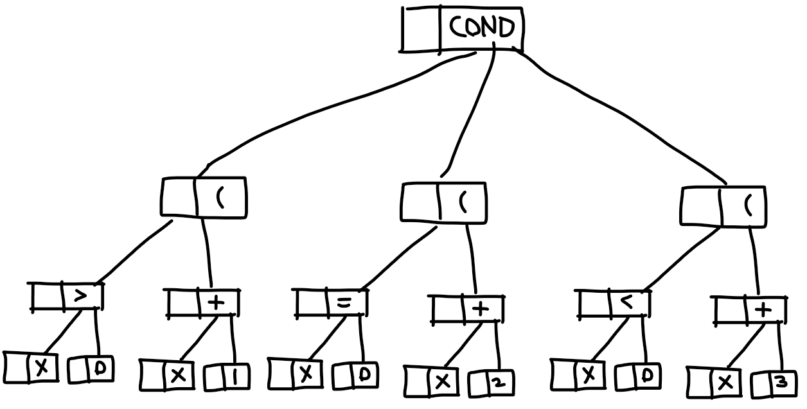
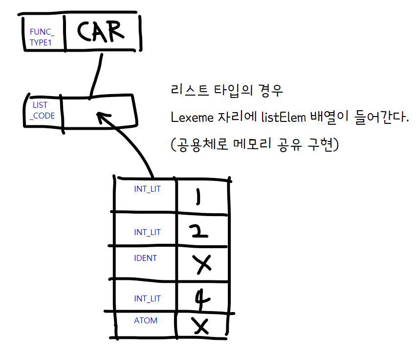
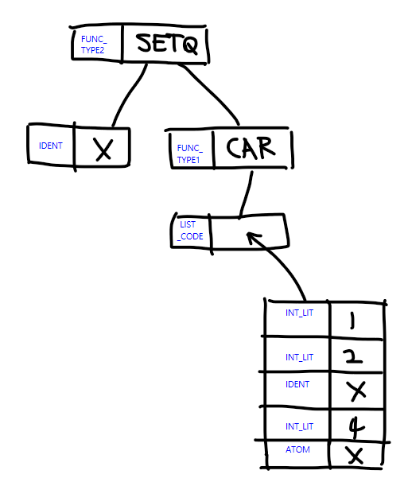
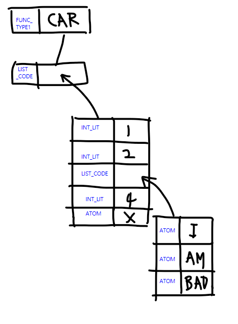

# About Parser


**코드의 작동 과정을 이해하는 것보다, 입출력되는 자료구조를 집중적으로 봐주세요~!**
[TOC]
.

## 개관

식이 lexer와 parser를 거쳐서 만들어지는 자료구조의 형태는 다음과 같습니다.



lexer의 출력물 = parser의 입력물 = element들의 배열

parser의 출력물 =  AST(Abstract Syntax Tree) 의 head 포인터 

.

여기서 한가지 주목할 점은, 지난 회의에서는 parser의 출력물을 parse tree 전체로 생각했었는데, **사실 AST는 parse tree에서 쓸모없는 내용(소괄호 등)은 생략하고 핵심 token들로만 구성된 트리**를 의미하는 것임을 알게 돼서, 불필요한 token들은 트리에서 제외하였습니다.

.

.

## element와 TreeNode

구조체로 정의된 element와 TreeNode가 핵심 자료구조입니다.


파란색으로 적은 것들은 code로, 사실 int 타입입니다.
그 오른쪽은 lexeme으로, 문자열 타입입니다.

.

element 코드:

```c
typedef struct element {
    int code;
    union {
        char lexeme[100];   // 기본
        struct element *listElem[100]; //code가 LIST_CODE인 경우에만 사용!
    };
} element;
```

union { } 된 것은 { } 안의 둘 중 한 가지만 사용한다는 뜻입니다. 대부분의 경우 lexeme을 사용합니다. 
(listElem을 사용하는 경우는 예시 5 참고)

.

TreeNode 코드:

```c
typedef struct TreeNode {
    element key;
    struct TreeNode *child1, *child2, *child3;
} TreeNode;
```

AST 는 최대 3개까지 자식노드(child1, child2, child3)를 가질 수 있습니다.

.

------

.

## AST 예시

.

### 예시1 - FUNC_TYPE1 인 함수 (매개변수가 1개인 함수)

#### (NUMBERP X)



child2, child3는 NULL을 가리킵니다.

(run 구현시 참고할 사항) 
NUMBERP 노드에서 자식노드의 code를 구하려면

```
노드->child1->key.code
```

lexeme을 구하려면 

```
노드->child1->key.lexeme
```

을 사용하면 됩니다!

.

.

### 예시2 - FUNC_TYPE2 인 함수 (매개변수가 2개인 함수)

#### (+ 7 3)



child3는 NULL을 가리킵니다.

.

.

### 예시3 - FUNC_TYPE3 인 함수 (매개변수가 3개인 함수)

#### (SUBST GOOD BAD '(I AM BAD))




.

.

### 예시4 - FUNC_TYPE4 인 함수 (COND 함수)

#### (COND ((> X 0) (+ X 1)) ((= X 0) (+ X 2)) ((< X 0) (+ X 3)))

*시간 관계상 code부분을 다 못채워넣었는데 실제로는 모두 채워져있습니다!




(참고...) 중간에 ( 토큰들을 넣은 이유: 
자식노드를 6개까지 가질 수 있으면 ( 토큰들을 안 넣어도 되는데 간결성을 위해 3진트리로 해결하려고  ( 토큰들을 넣었습니다!

.

.

### 예시5 - argument로 리스트가 있는 경우

#### (CAR '(1 2 X 4 'X))



.

(run 구현시 참고할 사항) 
그림상 LIST_CODE라고 적혀있는 노드에서,

 **i 번째**로 담고있는 code를 구하려면 

```
노드->key.listElem[i]->code
```

 lexeme을 구하려면  

```
노드->key.listElem[i]->lexeme
```

을 사용하면 됩니다!

.

.

### 예시6 - argument에 함수가 있는 경우

#### (SETQ X (CAR '(1 2 X 4 'X)))



SETQ 노드의 자식으로 CAR 같은 함수가 있는 게 가능합니다!

.

.

### 예시7 - argument인 리스트 안에 또 리스트가 있는 경우

#### (CAR '(1 2 '(I AM BAD) 4 'X))

